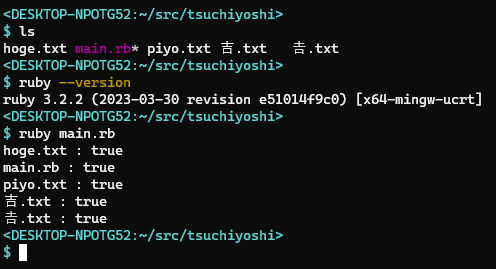
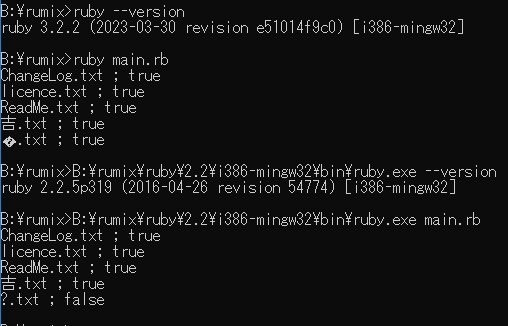

# Windows版Rubyで「𠮷.txt」というファイル名の存在がうまく検知できなかったり、表示できない件

- 「𠮷」（つちよし）は Unicode のコードポイント U+20BB7 。この文字は JIS第二水準にもなく、UTF16 でもサロゲートペアによる表現となってしまう
- （おそらくだが）Ruby 3 以前だと、ファイル情報取得の際に Unicode系 API が使われていないので、ANSI(CP932、いわゆる SJIS) による取得になっていると思われる
- Windows10 までのコマンドプロンプトだと、サロゲートペアでないと表現できない Unicode は表示できない

つまり、Ruby 3 以降を、WindowsTerminal で走らせれば大丈夫。

```main.rb
require 'pathname'

dir = Pathname.new(".")

dir.children.each do |cld|
  puts "#{cld} : #{cld.file?}"
end
```



コマンドプロンプトだと、こんな感じになるみたいです（[スレッド]より勝手に引用させていただきました）



[スレッドk]: https://mstdn.jp/@acid_rain@amefur.asia/110343374842403892

